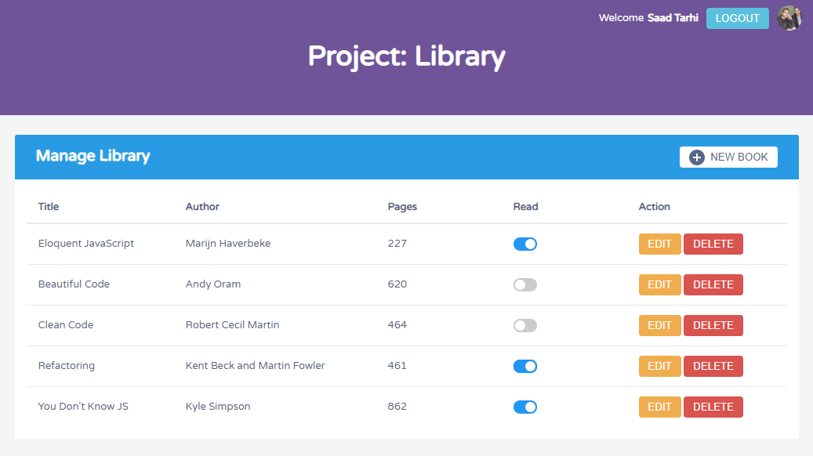

# 

# Library WebApp

This project is created solely using vanilla JS. Showcasing and making use of the concepts of [Prototypal inheritance](http://javascript.info/prototype-inheritance) and the [Constructor function](http://javascript.info/function-prototype).

This is a complete and fully functionnal WebApp Library, with the ability to create your own account and manage your own Library (Add, Edit, Delete your books). And all of your datas are synced and stored in the database using Google's mobile and web application development platform [Firebase](https://firebase.google.com/).

## Table of contents

1. [Demo](#demo)
2. [Technologies](#technologies)
3. [Features](#features)
4. [Development](#development)

## Demo

Here is the working live demo:
[https://tarhi-saad.github.io/Library/](https://tarhi-saad.github.io/Library/).

## Technologies

- Javascript modules, ES6
- [Firebase](https://firebase.google.com/) (firestrore & auth) & [FirebaseUI](https://github.com/firebase/firebaseui-web)
- [Webpack 4](https://webpack.js.org/)

## Features

- Secure User Authentification ([Firebase Authentication](https://firebase.google.com/products/auth/))
- Data storing & synchronisation ([Cloud Firestore](https://firebase.google.com/products/firestore/))
- Manage your Library by adding, editing & removing your books
- Material design

### To-do

- Improve the visual design with appropriate animations for different actions
- Add support for mobile users
- Add more options and informations for the books, and make a view for each one of them
- Add sorting and search features
- Add pagination

## Development

To set up this App locally, clone this repo to your desktop and run `npm install` to install all the dependencies. Then `npm start` to lunch the App.

> You will need to set up your own firebase profile and change the settings in the [config](src/modules/firebase.config.js) file to get the App working locally!

## License

> You can check out the full license [here](LICENSE)

This project is licensed under the terms of the **MIT** license.
